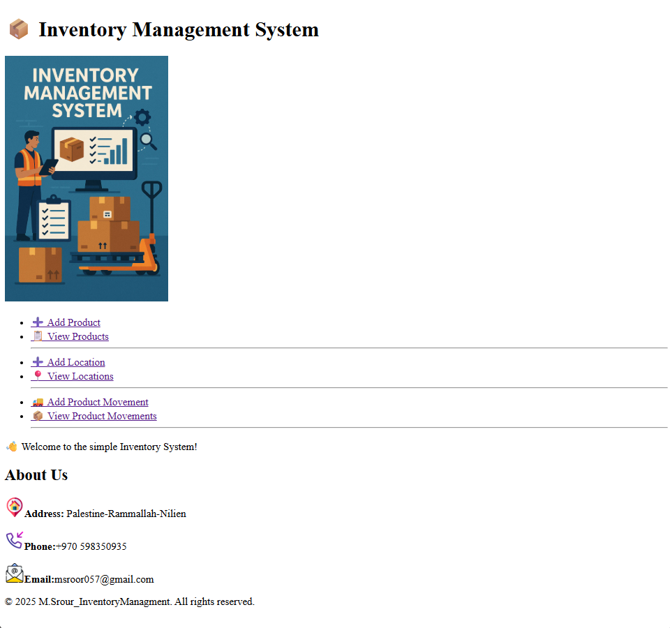
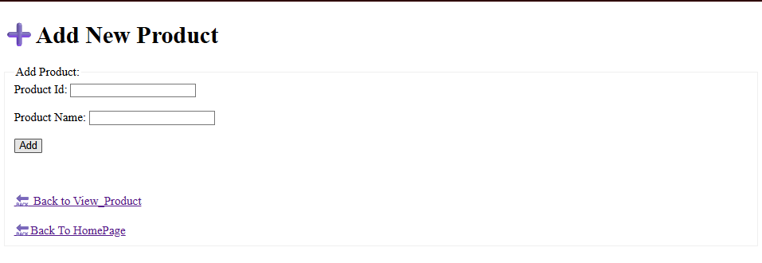
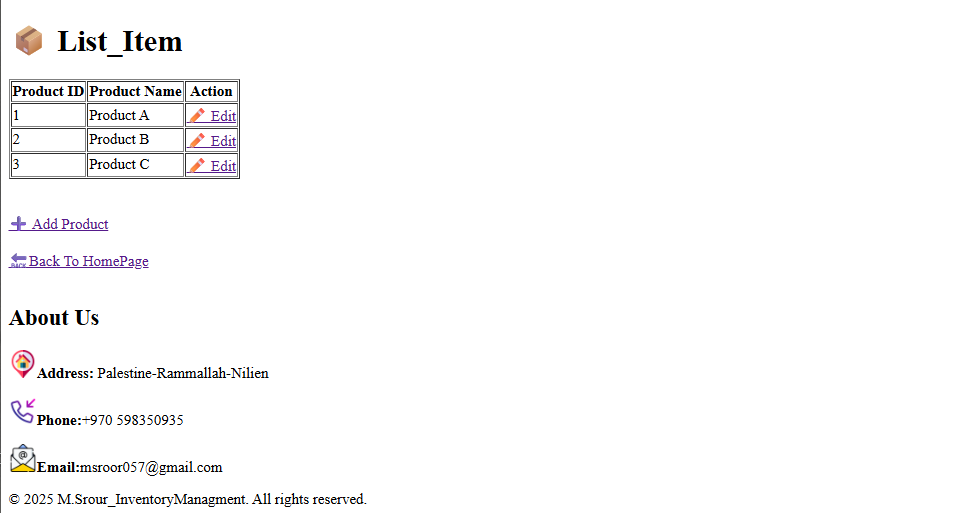
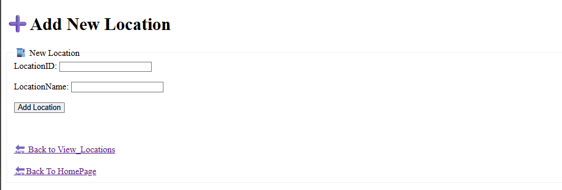
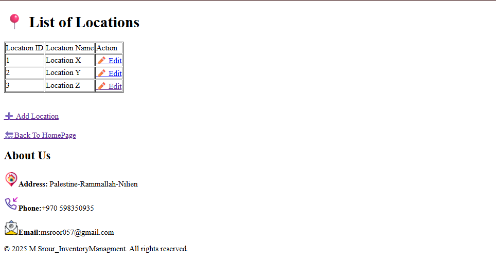
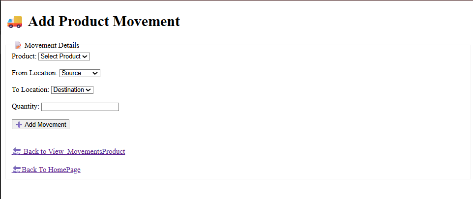
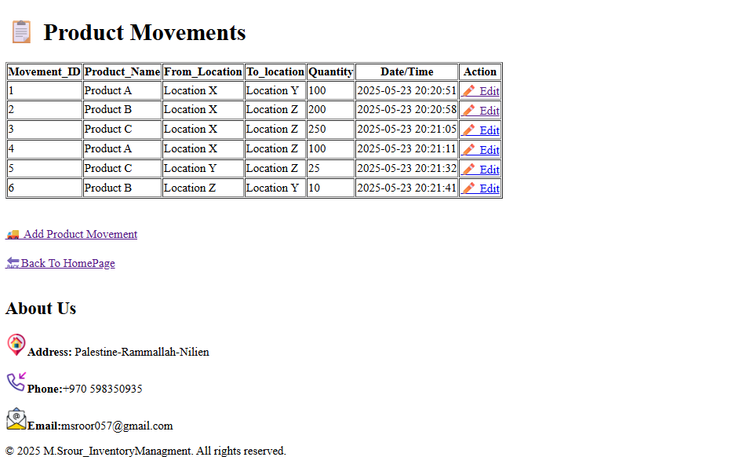

# inventory-management-system
This is a simple inventory management web application built with HTML, PHP, MySQL using PDO. It allows you to manage products, warehouse locations, and track product movements between locations.

## 🚀 Features

- Add, edit, and view products
- Add, edit, and view locations
- Record product movements between locations
- View all movement logs

- ## 🖥️ Screenshots

### 🏠 Home Page

### ➕ Add Product

### 📦 View Products

### ➕ Add Location

### 🏬 View Locations

### 🚚 Add Product Movement

### 📋 View Product Movements

---

## 🧪 Technologies Used

- PHP using PDO
- MySQL
- HTML

- 
## 📥 How to Run

1. Import the SQL database.
2. Configure your `db_config.php` with correct credentials.
3. Open the project in your browser via local server (e.g. `http://localhost/inventory_app/`).
4. Start managing your inventory!

